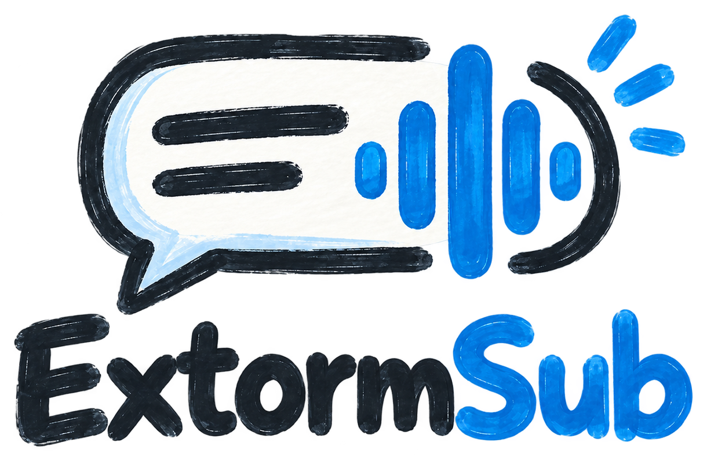

<p align="center">
  
</p>

<h1 align="center">ExtormSub</h1>

<p align="center">
  Real-time AI subtitles for anything your Windows PC plays: YouTube, movies, games, meetings and streams.
</p>

<p align="center">
  
</p>

- Captures **system audio** through WASAPI loopback, or a **microphone**.
- Transcribes **locally** with whisper.cpp (built in; GPU through Vulkan, or CUDA with the optional NVIDIA pack, falling back to the CPU) or **faster-whisper** (a private Python environment set up from the app). Silero VAD detects speech.
- Translates stable English lines into **Persian** through any OpenAI-compatible API (OpenAI, DeepSeek, Claude, Gemini, OpenRouter, Ollama…), or for free and offline with **LibreTranslate**, installed from the app.
- Shows the result as a **transparent, click-through subtitle overlay** above every app.

## Install

Download `ExtormSub-Setup-<version>.exe` from the [latest release](https://github.com/DanyHttp/ExtormSub/releases/latest) and run it. It installs per-user with no admin rights and needs no .NET, because it is self-contained.

## How to use

1. **Launch ExtormSub.** It lives in the system tray. On first launch the settings window opens on **Speech Recognition**.
2. **Download a speech model.** Pick the suggested one (150–600 MB). It is stored in `%LOCALAPPDATA%\ExtormSub\models`.
3. **(Optional) add a translation API key** under **Translation**. Without one, ExtormSub simply shows English subtitles; with one, any OpenAI-compatible provider works (OpenAI, DeepSeek, Claude, Gemini, OpenRouter, a local Ollama…). The key is stored DPAPI-encrypted on your PC.
   **No API key?** Pick **LibreTranslate** as the provider and press **Install**. It needs [Python 3.9+](https://www.python.org/downloads/) (tick *Add python.exe to PATH*), downloads about 1 GB once into a private folder, and starts by itself when you listen. **Test connection** starts it right away; the first start downloads the English and Persian models. Translation is plain machine translation, lower quality than an LLM, but free and nothing leaves your PC.
4. **Choose the audio source** under **Audio**: system audio (whatever you hear) or a microphone.
5. **Play something and press `Ctrl+Alt+S`.** The English line appears as the speech is recognised, with the Persian translation under it, like in the screenshot above.
6. Press `Ctrl+Alt+C` to unlock the overlay, drag or resize it where you want it, and press it again to make it click-through.

| Shortcut | Action |
|---|---|
| Ctrl+Alt+S | Start / stop subtitles |
| Ctrl+Alt+C | Lock / unlock (move, resize) the overlay |
| Ctrl+Alt+H | Show / hide subtitles |
| Ctrl+Alt+Shift+C | Emergency: always restores overlay control |

Command line: `--minimized` starts in the tray, and `--exit` closes a running instance cleanly (for installers and updaters).

**Updates.** The app checks GitHub releases 30 s after start and then daily; **About → Updates** has a manual check. When you click Install, it downloads the installer (resumable), checks its SHA-256 and runs it silently. If the running build is signed, the installer must carry a valid signature from the same publisher. The installer closes ExtormSub and reopens it afterwards.

## Where things live

| What | Where |
|---|---|
| Settings (JSON) | `%APPDATA%\ExtormSub\settings.json` |
| API keys (DPAPI-encrypted) | `%APPDATA%\ExtormSub\secrets\` |
| Models, history DB, logs | `%LOCALAPPDATA%\ExtormSub\` |
| LibreTranslate and its language models | `%LOCALAPPDATA%\ExtormSub\libretranslate\` (Remove deletes it) |

## Build from source

Requirements: Windows 10/11 x64 and the .NET 8 SDK.

```powershell
dotnet build ExtormSub.sln -c Release
dotnet test tests/ExtormSub.Tests
src\ExtormSub.App\bin\Release\net8.0-windows\win-x64\ExtormSub.exe
```

To build the installer:

```powershell
powershell -ExecutionPolicy Bypass -File build\build-installer.ps1 -Version 0.2.0
```

The script runs the tests, publishes self-contained, and compiles `installer\ExtormSub.iss`. It downloads a pinned Inno Setup compiler if none is installed. Add `-CertThumbprint <thumbprint>` (or `-CertFile cert.pfx -CertPassword …`) to sign the binaries and the installer with your own certificate.

## Project layout

```
src/ExtormSub.Core            pipeline, VAD segmentation, stabilizer, translation queue/cache, sequencing, settings — no UI, fully tested
src/ExtormSub.Infrastructure  WASAPI, whisper.cpp, Silero (ONNX), SQLite, DPAPI, hardware probing, model downloads
src/ExtormSub.App             WPF tray app: overlay, hotkeys, settings, history
tests/ExtormSub.Tests         127 xUnit tests (incl. real Silero, whisper.cpp and faster-whisper when installed)
```

Design: [ARCHITECTURE.md](ARCHITECTURE.md) · Plan: [IMPLEMENTATION_PLAN.md](IMPLEMENTATION_PLAN.md) · Decisions: [docs/architecture.md](docs/architecture.md) · Status: [docs/progress.md](docs/progress.md)

## Code signing policy

Free code signing provided by [SignPath.io](https://signpath.io), certificate by [SignPath Foundation](https://signpath.org).

- Release installers are built from this repository by the [release workflow](.github/workflows/release.yml) on GitHub-hosted runners, then signed.
- **Approver:** [@DanyHttp](https://github.com/DanyHttp), the only committer and maintainer, approves every signing request.
- **Privacy:** ExtormSub never uploads audio. Speech recognition runs on your PC. Only the recognised English text is sent to the translation provider *you* configure. The update check contacts GitHub and sends nothing about you.

## License

[MIT](LICENSE)
